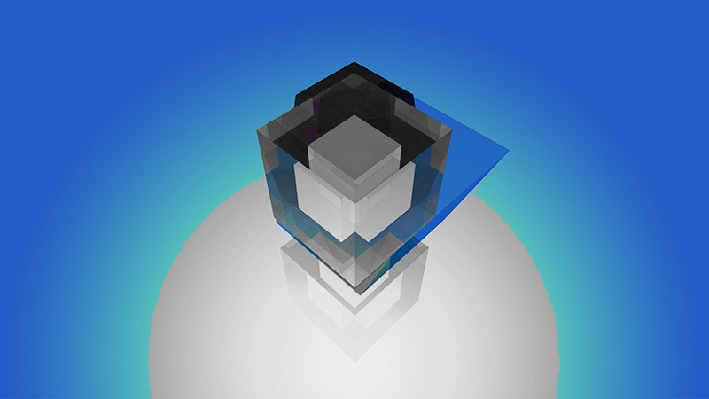

# Basic RGB channel manipulation in an Image without OpenCV

<html>

<head>
    <meta name="viewport" content="width=device-width, initial-scale=1.0"> 
    <!-- The title tag sets the title bar of the web bar -->
</head>

<body width = "device-width" bgcolor="#ffffff">
    <!-- The <body> tag lets the browser know that we are beginning the body of the web page.  The bgcolor option sets the background color to the web page -->

    <h1>Basic RGB channel manipulation in an Image without OpenCV</h1>

    

    <ol>
        <li>
            Original Image -
             
            
              
        </li>
        <li>
            Grayscale Image -
             
            
              
            Formula used for grayscale -
             
            gray = integer(0.2126R + 0.7152G + 0.0722B), where R,G,B are the respective colour channel values.
             
            While a grayscale image can be obtained in numerous ways, this are the colour coefficiants recommended by
            <a href="https://en.wikipedia.org/wiki/Rec._709">ITU-R BT.709-6 Recommendation.</a>
             
            This is done because the human eye has different sensitivity to different colours and therefore, the RGB
            channels are weighted.
              
        </li>
        <li>
            Selective Grayscaling - Convert every other colour in the image except the shades and hues of Blue -
             
            
              
            This was achieved by applying the grayscaling formula to all pixels except the pixels  
            where the Blue channel value was both greater than 43 and the Red and Green channel values.  
            It was specifically set to be greater than 43 because anything less than that results in  
            shades of gray or eventually black and not shades of blues.
              
        </li>
        <li>
            Negative Image -
             
            
              
            This was achieved by replacing the R, G, B values with (255-R), (255-G), (255-B) respectively.
              
        </li>
        <h3>Additional Examples - </h3>
         
        
        
        
        
         
        
        
        
        
         
        
        
        
        
         
        
        
        
        
         
        
        
        
        
         
        
        
        
        
    </ol>
     
    

</body>

</html>
 
